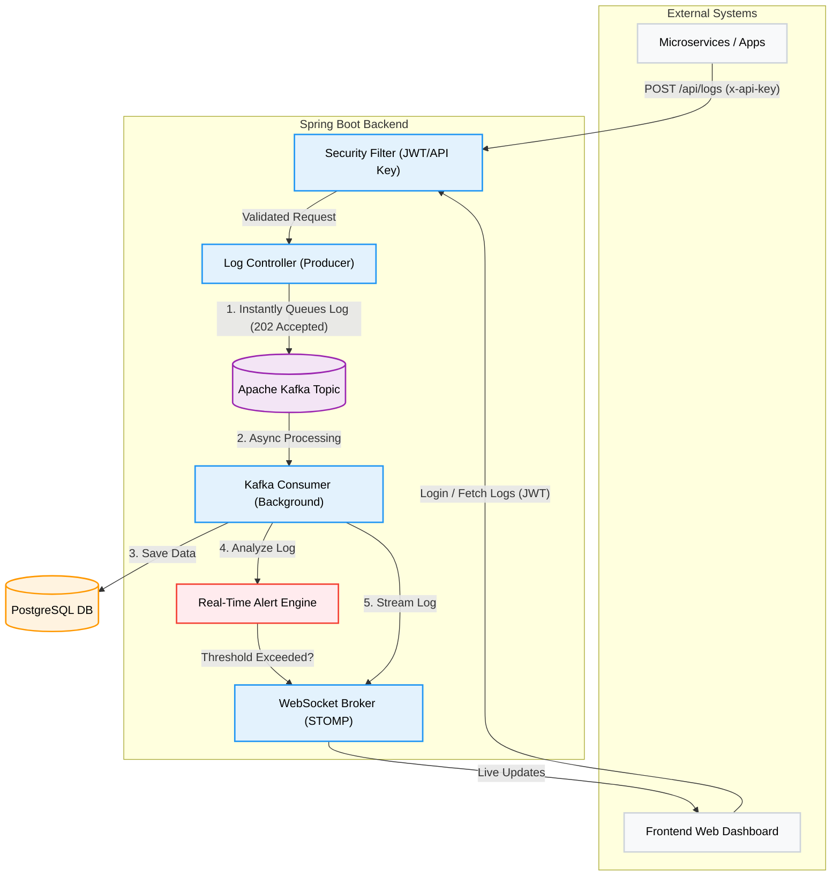

# 📡 Real-Time Multi-Tenant Log Monitoring System

An enterprise-grade, real-time log monitoring and alerting backend. Built with Spring Boot, this system allows multiple companies to securely send, store, and monitor their application logs in real-time using **Apache Kafka**, WebSockets, and API Keys.


## ✨ Core Features

* **⚡ Event-Driven & Asynchronous:** High-throughput log ingestion using **Apache Kafka**. The API responds instantly (`202 Accepted`), while logs are processed asynchronously in the background.
* **🏢 Multi-Tenant Architecture:** Data is strictly isolated. Companies can only access their own logs via secure API Keys.
* **🌊 Real-Time Streaming:** Built-in WebSocket (STOMP) server streams incoming logs instantly to connected frontend dashboards.
* **🚨 Automated Alert Engine:** Actively monitors log streams and triggers real-time alerts if specific thresholds (e.g., 5 errors in 1 minute) are breached.
* **🔐 Advanced Security:** Dual-layer security using **JWT** for user dashboard authentication and **API Keys** for machine-to-machine log ingestion.

## 🏗️ System Architecture


1. **Microservices/Clients** send logs securely using their unique `x-api-key`.
2. **Spring Boot App** intercepts requests, validates the API key, and instantly pushes the payload to an **Apache Kafka Topic**.
3. **Kafka Background Consumer** processes the queue, storing logs in PostgreSQL without blocking the main HTTP threads.
4. **Alert Engine** evaluates the log against company-specific thresholds.
5. **WebSocket Broker** broadcasts the log (and any alerts) to the authenticated React/Angular frontend in real-time.

## 🛠️ Tech Stack

* **Backend:** Java 17, Spring Boot 3, Spring Web
* **Message Broker:** Apache Kafka (Dockerized)
* **Security:** Spring Security, JWT, API Key Authentication
* **Real-Time:** Spring WebSockets, STOMP protocol
* **Database:** PostgreSQL, Spring Data JPA / Hibernate

## 🚀 Getting Started

### Prerequisites
* Java 17+
* PostgreSQL running on port `5432`
* **Docker Desktop** (Required for Kafka)

### Installation & Setup

1. **Clone the repository:**
   ```bash
   git clone https://github.com/your-username/real-time-log-monitor.git
   cd real-time-log-monitor
   ```

2. **Configure Environment Variables:**
   This project uses environment variables for security. You must configure these before running the application:
   * `DB_USERNAME`: Your PostgreSQL username
   * `DB_PASSWORD`: Your PostgreSQL password
   * `JWT_SECRET`: A secure, 256-bit secret string for token generation

3. **Start Apache Kafka via Docker:**
   ```bash
   docker-compose up -d
   ```

4. **Run the application:**
   ```bash
   ./mvnw spring-boot:run
   ```

## 📡 API Reference

| Method | Endpoint | Description | Auth Required |
|---|---|---|---|
| `POST` | `/auth/register` | Register a new user & company | None |
| `POST` | `/auth/login` | Get JWT token | None |
| `POST` | `/api/logs` | Ingest a log asynchronously | `x-api-key` header |
| `GET` | `/api/logs` | Fetch company logs | `Bearer {JWT}` |

---
## 📸 Screenshots

-> /auth/login


-> /api/logs


-> /api/register  


---

*Built by [Roshan Keshri](https://www.linkedin.com/in/roshan-keshri/) - Feel free to reach out!*
